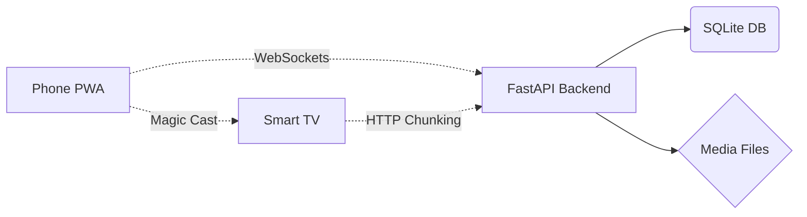

<div align="center">

# 🚀 NexusMedia

[](https://fastapi.tiangolo.com/)
[](https://www.python.org/)
[]()
[]()

**A blazing-fast, self-hosted media server and file manager.**
Accessible from **any device** on your local network — Android, iPhone, Smart TV, and Jio Set Top Box.

</div>

<br/>

> 💡 **The Vision**: Built entirely with Python (FastAPI) and Vanilla JS. Zero heavy frontend frameworks. High-performance HTTP range requests ensure media streams instantly across your local network without buffering.

---

## ✨ Extraordinary Features (How it Works & Limitations)

### 📺 1. Magic Cast System
* **How it works**: Bypasses the need for Chromecast hardware. It uses Python WebSockets to instantly push the URL of a video, image, or PDF from your phone directly to the TV browser screen. 
* **Limitations**: Requires both devices to be on the same local network. The TV browser must remain open on the `http://<ip>:8000/cast` page to receive the signal.
* **Advantage**: Ultra-fast, near-zero lag, and zero compression.

### 📱 2. PWA Ready (Native App Experience)
* **How it works**: Uses a `manifest.json` file that allows iOS and Android devices to "Add to Home Screen". It launches as a standalone application without the Safari/Chrome address bar.
* **Limitations**: It is still a web wrapper. iOS handles background processes differently than native apps, so if you minimize the app, active downloads or video streaming might pause after a few minutes.

### 📄 3. Advanced PDF Engine (TV Optimized)
* **How it works**: Uses `pdf.js` paired with an `IntersectionObserver`. Instead of loading a 500-page PDF at once (which crashes TVs), it uses "lazy loading" to only render the exact page you are looking at. It also dynamically lowers the graphics resolution on TVs to save RAM.
* **Limitations**: Extremely massive PDFs with highly complex vector graphics may still take a second to render on older, weak Set-Top Box processors. 

### 🎥 4. Cinematic Video Player
* **How it works**: A custom-built HTML5 player featuring Picture-in-Picture, mobile double-tap to seek, and persistent SQLite memory (if you close a movie halfway, it remembers exactly where you stopped).
* **Limitations**: It streams raw files directly. It does **not** transcode videos on the fly. This means your browser must natively support the video format (e.g., standard MP4 or WebM). `.mkv` files with obscure codecs may only play audio.

### ⚡ 5. Instant Streaming (HTTP Range Requests)
* **How it works**: The FastAPI backend calculates byte-ranges in real-time. Instead of downloading a 20GB movie, it chunks the file and only sends the exact timestamp you are watching. This allows you to skip to the end of a massive 4K movie instantly without buffering.
* **Limitations**: Since it streams raw massive files, it is highly dependent on your local router's speed. A 5GHz Wi-Fi network is strongly recommended for streaming 20GB+ 4K files without stuttering.

### 🛋️ 6. TV Scaling & Smart Navigation
* **How it works**: The system detects if you are using a Smart TV or Jio STB browser. It automatically injects a `tv-mode` CSS class that enlarges fonts, widens the UI, and adds massive floating scroll buttons so you can read PDFs from the couch.
* **Limitations**: Locked-down TV browsers (like JioSphere) force a "virtual pointer" overlay. We cannot disable this pointer via code, which is why the floating fallback buttons are required for scrolling.

<br/>

---

## 🚀 Interactive Quick Start

<details>
<summary><b>🛠️ 1. Setup (First Time) </b> <i>(Click to expand)</i></summary>
<br/>

```bash
# Clone the repository
git clone https://github.com/MagicalMadhur/nexus-media-server.git
cd nexus-media-server

# Create a virtual environment
python -m venv venv
venv\Scripts\activate

# Install dependencies
pip install -r requirements.txt
```
</details>

<details>
<summary><b>▶️ 2. Run the Server </b> <i>(Click to expand)</i></summary>
<br/>

```bash
# Start the FastAPI backend:
venv\Scripts\activate
python -m uvicorn app.main:app --host 0.0.0.0 --port 8000
```
</details>

<details>
<summary><b>🌍 3. Access your Media </b> <i>(Click to expand)</i></summary>
<br/>

Open any browser on your local network and head to:
```text
http://<your-laptop-ip>:8000
```
*(The server will print its exact local IP address in the terminal on startup).*
</details>

<br/>

---

## 📺 TV Remote & Navigation (Jio STB)

> ⚠️ **Note for Smart TVs**: NexusMedia automatically detects locked-down TV browsers like JioSphere!

* **Smart UI Scaling**: Automatically detects TV screens and enlarges the interface.
* **Scroll Fallbacks**: Uses huge floating **Up/Down** buttons to bypass TV pointer restrictions for reading PDFs.
* **Magic Cast Mode**: Just open `http://<your-ip>:8000/cast` on the TV. Open the app on your phone, and you can instantly "push" any file to the big screen!

---

## 🏗️ Architecture



### Tech Stack
* **Backend**: Python, FastAPI, Uvicorn, SQLite
* **Frontend**: HTML5, CSS3, Vanilla JavaScript, PDF.js
* **Icons**: Font Awesome 6

---

## 🔒 Security

* **Air-gapped by default**: Only accessible on your local Wi-Fi (binds to `0.0.0.0`).
* **Zero Internet Required**: Once set up, the entire app (including the PDF engine) runs offline!
