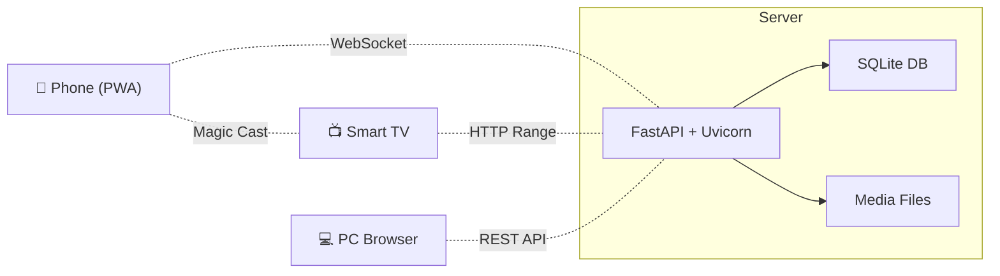

<div align="center">


### Your Home. Your Media. Your Rules.

A blazing-fast, self-hosted media server and file manager built with **Python** and **Vanilla JS**.<br/>
Stream to **any device** on your local network — Phone, PC, Smart TV, or Jio Set-Top Box.

<br/>

[](https://fastapi.tiangolo.com/)
[](https://www.python.org/)
[]()
[]()
[]()
[](LICENSE)

<br/>

**[Features](#-features)** · **[Quick Start](#-quick-start)** · **[How It Works](#-how-it-works)** · **[Architecture](#-architecture)** · **[TV Guide](#-smart-tv-guide)** · **[Contributing](#-contributing)**

</div>

<br/>

---

<br/>

## 💡 Philosophy

> Most media servers are overengineered. They want you to install Docker, configure databases, set up reverse proxies, and sacrifice a weekend.
>
> **NexusMedia is different.** Clone → `pip install` → Run. That's it. No Docker. No Nginx. No cloud accounts. Your files never leave your Wi-Fi.

<br/>

## ✨ Features

<table>
<tr>
<td width="50%">

### 🎬 Magic Cast System
Bypass Chromecast hardware entirely. Push any video, image, or PDF from your **phone to the TV** in under a second using WebSockets. Zero compression, zero lag.

</td>
<td width="50%">

### 🎥 Cinematic Video Player
Custom HTML5 player with PiP, double-tap seek, playback speed control (0.25x–4x), long-press for 2x speed, subtitle support, and **persistent watch history** — it remembers exactly where you stopped.

</td>
</tr>
<tr>
<td width="50%">

### ⚡ Instant Streaming
HTTP Range Requests stream the exact bytes you need. Skip to the end of a 20GB 4K movie **instantly** — no buffering, no re-downloading. Your browser does the heavy lifting.

</td>
<td width="50%">

### 📄 Advanced PDF Engine
Powered by `pdf.js` with `IntersectionObserver` for lazy page rendering. Opens 500-page PDFs without crashing TVs. Auto-detects weak GPU and lowers render quality to save RAM.

</td>
</tr>
<tr>
<td width="50%">

### 📱 PWA — Native App Experience
Add to Home Screen on iOS/Android. Launches fullscreen without browser chrome. Lock screen media controls via the Media Session API. Feels native, costs nothing.

</td>
<td width="50%">

### 📡 Live Screen Share
WebRTC-powered screen sharing with a built-in signaling server. Share your screen or camera to any device on the network. No third-party service needed.

</td>
</tr>
<tr>
<td width="50%">

### 🗂️ Full File Manager
Browse, upload (chunked — supports 50GB+ files), rename, move, copy, delete, and zip-download. Drag-and-drop uploads. Grid + List views. Context menus. Keyboard shortcuts.

</td>
<td width="50%">

### 🛋️ Smart TV Mode
Auto-detects TV browsers (JioSphere, etc.) and injects `tv-mode` CSS — enlarged fonts, wider UI, and floating scroll buttons to work around TV pointer restrictions.

</td>
</tr>
<tr>
<td width="50%">

### 🎵 Music Player
Full-featured player with album art extraction, shuffle, repeat, queue management, and a Spotify-style bottom bar that persists across the page.

</td>
<td width="50%">

### 🔍 Instant Search + Auto Discovery
Global search across all media types. Real-time file system monitoring via `watchdog` — new files are indexed automatically. mDNS broadcasting for zero-config network discovery.

</td>
</tr>
</table>

<br/>

---

<br/>

## 🚀 Quick Start

### Prerequisites

- **Python 3.12+**
- **FFmpeg** (optional — for video thumbnails and metadata extraction)

### 1. Clone & Install

```bash
git clone https://github.com/MagicalMadhur/nexus-media-server.git
cd nexus-media-server

python -m venv venv
venv\Scripts\activate        # Windows
# source venv/bin/activate   # macOS/Linux

pip install -r requirements.txt
```

### 2. Run

```bash
python -m uvicorn app.main:app --host 0.0.0.0 --port 8000
```

Or use the batch file:

```bash
run.bat
```

### 3. Access

Open any browser on your local network:

```
http://<your-pc-ip>:8000
```

> The server prints its exact local IP and a scannable **QR code** in the terminal on startup.

<br/>

---

<br/>

## 🔬 How It Works

Every feature in NexusMedia is built on a deliberate technical choice. Here's the honest breakdown — including the limitations.

<details>
<summary><b>🎬 Magic Cast — WebSocket Push to TV</b></summary>
<br/>

**Mechanism:** The TV browser sits on `/cast` with an open WebSocket connection. When you select a file on your phone, the server uploads it, generates a viewer URL, and broadcasts it to all connected TV sockets. The TV navigates to the URL instantly.

**Advantage:** Near-zero latency. No transcoding, no compression. The TV browser renders the raw file directly.

**Limitation:** Both devices must be on the same local network. The TV browser must remain on the `/cast` page to receive the signal. If the TV browser sleeps or navigates away, the connection drops.

</details>

<details>
<summary><b>⚡ HTTP Range Requests — Byte-Level Streaming</b></summary>
<br/>

**Mechanism:** FastAPI calculates byte ranges in real-time from the `Range` header. Instead of downloading a 20GB file, it chunks the file and serves only the exact bytes the browser requests — enabling instant seeking.

**Advantage:** Skip to any timestamp in a massive 4K movie without buffering. Pause/resume works natively. No server-side transcoding overhead.

**Limitation:** Files are streamed raw — no on-the-fly transcoding. Your browser must natively support the video codec. Standard MP4 (H.264) and WebM work everywhere. `.mkv` files with obscure codecs (e.g., HEVC without browser support) may only play audio. A **5GHz Wi-Fi** network is strongly recommended for 4K files.

</details>

<details>
<summary><b>📄 PDF Engine — Lazy Rendering for Weak Devices</b></summary>
<br/>

**Mechanism:** `pdf.js` renders pages into `<canvas>` elements. An `IntersectionObserver` monitors which pages are visible and only renders those — not the entire document. On TV-mode devices, the render scale drops from 1.5x to 1.0x to reduce GPU load.

**Advantage:** Opens 500+ page PDFs instantly without crashing. Even works on Jio Set-Top Box browsers with ~512MB RAM.

**Limitation:** Extremely complex vector-heavy pages may take a beat to render on low-end STB processors. Password-protected PDFs are supported (prompted inline).

</details>

<details>
<summary><b>📡 Live Screen Share — WebRTC Signaling</b></summary>
<br/>

**Mechanism:** The FastAPI backend acts as a WebSocket signaling server. The broadcaster captures screen/camera via `getDisplayMedia`/`getUserMedia`, exchanges SDP offers/answers through the server, and establishes direct peer-to-peer WebRTC connections with each viewer.

**Advantage:** Video streams directly between devices — the server only handles signaling, not the actual video data. Low latency, high quality.

**Limitation:** Screen capture requires HTTPS on non-localhost origins (the server auto-runs a second HTTPS instance on port 8443 with self-signed certs). Viewers must accept the browser security warning once. Mobile browsers don't support `getDisplayMedia` — use camera share instead.

</details>

<details>
<summary><b>📱 PWA — Add to Home Screen</b></summary>
<br/>

**Mechanism:** A `manifest.json` + service worker allow iOS and Android to "install" the web app to the home screen. It launches in `standalone` mode — no address bar, no browser chrome.

**Advantage:** Feels like a native app. Lock screen media controls work via the Media Session API.

**Limitation:** iOS handles PWA background processes differently. If you minimize the app, active downloads or video streaming may pause after a few minutes. This is a Safari limitation, not a NexusMedia limitation.

</details>

<br/>

---

<br/>

## 🏗️ Architecture

```
nexus-media-server/
├── app/
│   ├── main.py              # FastAPI entry point, lifespan, mounts
│   ├── config.py             # Settings singleton (SQLite-backed)
│   ├── database.py           # SQLite schema, queries, watch history
│   ├── models.py             # Pydantic models
│   ├── routes/
│   │   ├── dashboard.py      # Home page with stats & continue watching
│   │   ├── videos.py         # Video library + player pages
│   │   ├── streaming.py      # HTTP Range Request engine
│   │   ├── music.py          # Music library + player bar
│   │   ├── photos.py         # Photo gallery
│   │   ├── documents.py      # Document library
│   │   ├── files.py          # File explorer (CRUD + chunked upload)
│   │   ├── search.py         # Global search + settings API
│   │   ├── cast.py           # Magic Cast (WebSocket push to TV)
│   │   └── webrtc.py         # WebRTC signaling server
│   ├── services/
│   │   ├── scanner.py        # Media scanner + watchdog monitor
│   │   ├── mdns.py           # Zeroconf/mDNS broadcaster
│   │   └── ssl_cert.py       # Self-signed cert generator
│   ├── static/               # CSS, JS, PWA manifest, icons
│   └── templates/            # Jinja2 HTML templates
├── data/                     # SQLite DB, thumbnails, certs
├── uploads/                  # User uploads directory
├── requirements.txt
├── setup.bat                 # Windows one-click setup
└── run.bat                   # Windows one-click run
```



<br/>

### Tech Stack

| Layer | Technology |
|-------|------------|
| **Backend** | Python · FastAPI · Uvicorn · SQLite |
| **Frontend** | HTML5 · CSS3 · Vanilla JavaScript |
| **Media** | FFmpeg (thumbnails) · pdf.js · Mutagen (audio metadata) |
| **Networking** | WebSockets · WebRTC · mDNS (Zeroconf) · SSL |
| **Icons** | Font Awesome 6 |

<br/>

---

<br/>

## 📺 Smart TV Guide

> NexusMedia automatically detects locked-down TV browsers like JioSphere and adapts the UI.

| Feature | How It Works |
|---------|-------------|
| **Auto UI Scaling** | Detects TV screens → enlarges fonts, widens cards, increases tap targets |
| **Floating Scroll Buttons** | Huge ▲/▼ buttons bypass TV pointer restrictions for reading PDFs from the couch |
| **Magic Cast Receiver** | Open `http://<your-ip>:8000/cast` on the TV → it becomes a cast target for all phones on the network |
| **Keyboard Remote** | Arrow keys navigate, Enter/Space = page down, Backspace = page up — maps to Jio STB remote buttons |

<br/>

---

<br/>

## 🔒 Security

- **Air-gapped by default** — Only accessible on your local Wi-Fi. Binds to `0.0.0.0` but doesn't expose to the internet.
- **Zero internet required** — Once installed, everything (including the PDF engine) runs fully offline.
- **Path traversal protection** — All file operations are sandboxed to configured media folders.
- **Optional password** — Set a server password in Settings to restrict access on shared networks.

<br/>

---

<br/>

## 🤝 Contributing

Contributions are welcome! Here's how to get started:

1. **Fork** the repository
2. **Create a branch** — `git checkout -b feature/amazing-feature`
3. **Commit** your changes — `git commit -m "feat: add amazing feature"`
4. **Push** to the branch — `git push origin feature/amazing-feature`
5. **Open a Pull Request**

<br/>

---

<br/>

## 📄 License

This project is licensed under the **MIT License** — see the [LICENSE](LICENSE) file for details.

<br/>

<div align="center">
<sub>Built with ❤️ by <a href="https://github.com/MagicalMadhur">MagicalMadhur</a></sub>
</div>
